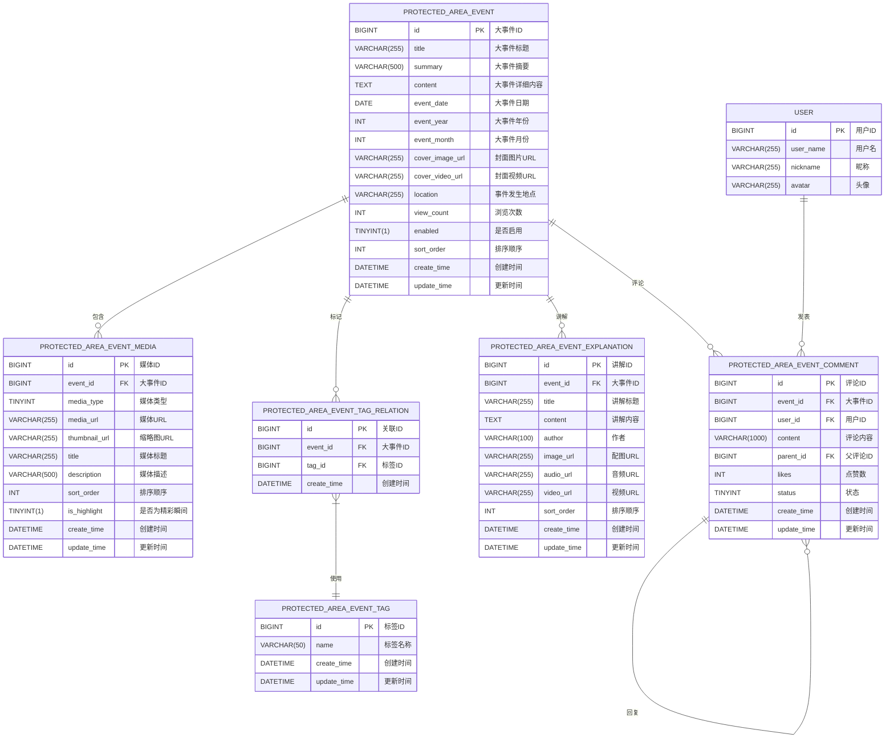

# 保护区大事件模块ER图

以下是保护区大事件模块的实体关系图，展示了各个表之间的关系。

## 表关系说明

1. **保护区大事件表(PROTECTED_AREA_EVENT)** 与 **保护区大事件媒体表(PROTECTED_AREA_EVENT_MEDIA)** 是一对多关系，一个大事件可以包含多个媒体资源。

2. **保护区大事件表(PROTECTED_AREA_EVENT)** 与 **保护区大事件评论表(PROTECTED_AREA_EVENT_COMMENT)** 是一对多关系，一个大事件可以有多条评论。

3. **保护区大事件表(PROTECTED_AREA_EVENT)** 与 **保护区大事件讲解表(PROTECTED_AREA_EVENT_EXPLANATION)** 是一对多关系，一个大事件可以有多条讲解内容。

4. **保护区大事件表(PROTECTED_AREA_EVENT)** 与 **保护区大事件标签表(PROTECTED_AREA_EVENT_TAG)** 是多对多关系，通过 **保护区大事件-标签关联表(PROTECTED_AREA_EVENT_TAG_RELATION)** 建立关联。

5. **用户表(USER)** 与 **保护区大事件评论表(PROTECTED_AREA_EVENT_COMMENT)** 是一对多关系，一个用户可以发表多条评论。

6. **保护区大事件评论表(PROTECTED_AREA_EVENT_COMMENT)** 自关联，实现评论回复功能，一条评论可以有多条回复评论。
