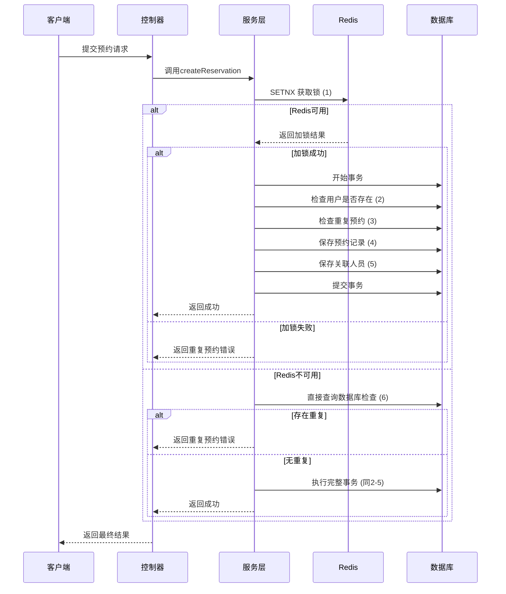

# 个人预约服务改进说明

## 1. 整体架构设计

### 1.1 分层架构
```
┌───────────────────────┐
│       API Layer       │ ← 接收请求，参数校验
└──────────┬────────────┘
           ↓
┌───────────────────────┐
│    Service Layer      │ ← 业务逻辑处理
└──────────┬────────────┘
           ↓
┌───────────────────────┐
│  Repository Layer     │ ← 数据持久化
└──────────┬────────────┘
           ↓
┌───────────────────────┐
│      Cache Layer      │ ← Redis缓存处理
└───────────────────────┘
```

## 2. 主要改进内容

### 2.1 防重复预约机制

#### 2.1.1 Redis防重设计
- 使用Redis的SETNX实现原子操作
- 生成唯一key规则：`reservation:lock:{visit_date}:{time_slot}:{id_type}:{id_number}`
- 设置30秒过期时间，防止死锁

#### 2.1.2 数据库防重设计
- 添加复合唯一索引：`(reservation_id, id_type, id_number, is_contact)`
- Redis故障时自动降级到数据库检查

### 2.2 事务管理方案

#### 2.2.1 Spring声明式事务
- 使用`@Transactional(rollbackFor = Exception.class)`确保异常回滚
- 所有写操作方法都添加了事务注解

### 2.3 异常处理设计

#### 2.3.1 自定义异常体系
- `ReservationException`：业务异常基类
- `DuplicateReservationException`：重复预约异常
- `ServiceUnavailableException`：服务不可用异常

#### 2.3.2 全局异常处理器
- 统一处理各种业务异常
- 返回标准的错误码和错误信息

### 2.4 降级方案设计

#### 2.4.1 Redis故障降级
- Redis连接失败时自动降级到数据库检查
- 记录降级日志，便于监控和排查

### 2.5 性能优化措施

#### 2.5.1 缓存预热
- 每天6点执行定时任务预热热门时段数据
- 每小时清理过期的预约锁

#### 2.5.2 批量查询优化
- 使用JPA优化查询语句
- 合理使用索引提高查询性能

## 3. 完整流程时序图



## 4. 监控与告警设计

### 4.1 关键指标监控
- Redis健康状态
- 数据库查询耗时
- 事务成功率
- 重复预约告警率

### 4.2 日志规范
- 在关键节点添加详细日志
- 记录Redis加锁、数据库操作等关键信息
- 异常情况记录错误日志

## 5. 新增文件列表

### 5.1 异常处理类
- `com/scenic/exception/reservation/ReservationException.java`
- `com/scenic/exception/reservation/DuplicateReservationException.java`
- `com/scenic/exception/reservation/ServiceUnavailableException.java`
- `com/scenic/exception/handler/GlobalExceptionHandler.java`

### 5.2 工具类
- `com/scenic/utils/RedisUtil.java`
- `com/scenic/utils/ReservationUtil.java`

### 5.3 定时任务
- `com/scenic/schedule/ReservationCacheSchedule.java`

### 5.4 数据库脚本
- `src/main/resources/db/migration/V1_1__add_reservation_unique_index.sql`

## 6. 修改文件列表

### 6.1 服务接口
- `com/scenic/service/appointment/IndividualReservationService.java`

### 6.2 服务实现
- `com/scenic/service/appointment/impl/IndividualReservationServiceImpl.java`

### 6.3 Mapper接口
- `com/scenic/mapper/appointment/IndividualReservationMapper.java`

### 6.4 主应用类
- `com/scenic/Application.java`

## 7. 使用说明

### 7.1 配置要求
- Redis服务正常运行
- 数据库连接正常
- 定时任务已启用

### 7.2 部署步骤
1. 执行数据库脚本添加唯一索引
2. 部署应用并启动
3. 验证Redis缓存功能
4. 测试防重复预约功能

### 7.3 监控要点
- 观察Redis使用情况
- 监控重复预约告警
- 跟踪事务执行成功率
- 检查定时任务执行状态